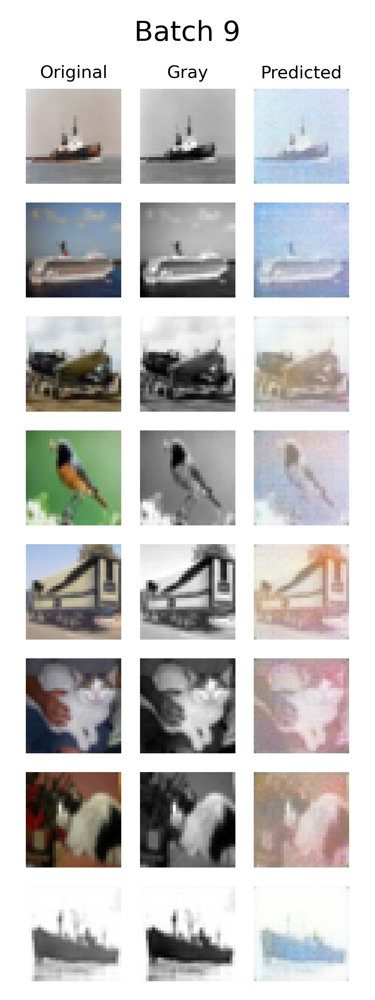

<p align="center"> 
 <h1 align="center">Generative Approaches to CIFAR10 Colourization</h1>
</p>

## Introduction
In this work, I generalize the colorization procedure using a conditional Deep Convolutional Generative Adversarial Network (DCGAN).  
The network is trained on the datasets [CIFAR-10](https://www.cs.toronto.edu/~kriz/cifar.html).  
Some of the results from CIFAR-10 dataset are [shown here.](#results)

## How to Train
- To train model in your device
```python main.py -b 1024 -i True```
- To train model in [Colab](https://colab.research.google.com/)
```!python3 main.py -b 1024 -i True -nw 2 ```
## How to test
- You can simply run `python test.py`
- Then you can see the result in folder `image`

## Networks Architecture
### Generator Architecture
I use U-net architecture 
like fully convolutional architecture (with concatenation of opposite layers) for the generator, and the G loss function is L1 regularized, 
which produces an effect where the generator is forced to produce results that are similar to the ground truth on the pixel level. 
This will theoretically preserve the structure of the original images and prevent the generator from assigning arbitrary colors to pixels just to fool the discriminator.
The generator takes the grayscaled image as an input, while the discrimator takes either the original image or generated image plus the condition, which is the grayscaled image in this case.

<p align="center">
  
</p>

### Discrimator Architecture
I use patch-gan architecture: a series of 4x4 convolutional layers with stride 2 with the number of channels being doubled after each downsampling. 
All convolution layers are followed by batch normalization, leaky ReLU activation with slope 0.2. After the last layer, 
a sigmoid function is applied to return probability values of 32x32 patches of the input being real or fake. 
We take the average of the probabilities as the network output!
<p align="center">
  
</p>


## Results
Here are some good results and some cases, where the model did not work (on the test part of the dataset) after training 20 epochs.
<p align="center">
  
</p>
